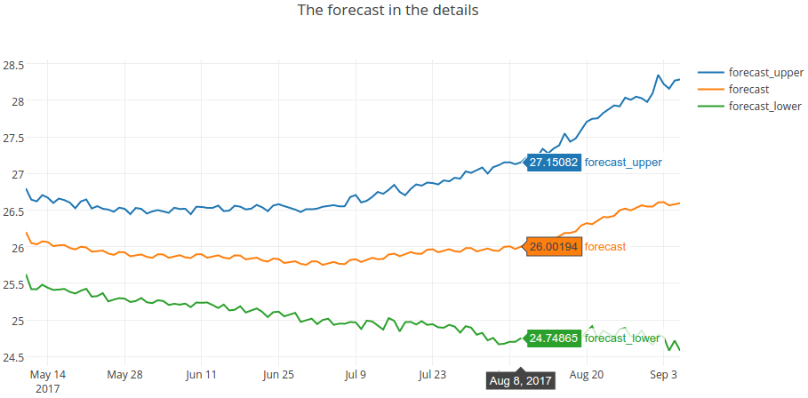
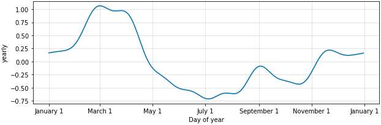

# Predict fluctuations in currency quote using [Prophet](https://facebookincubator.github.io/prophet/)


## Overview
Let's try build model with help of [Prophet](https://facebookincubator.github.io/prophet/) to prеditi 
fluctuations in currency quotes. For current example I took currency pair UAH/USD for date range 2012-2017. 
The forecast looks quite realistic, the forecast components give some ideas about seasonality. 
The time series forecast can be used as a feature for another machine learning models.

[Prophet](https://facebookincubator.github.io/prophet/) works pretty well from the box. 
You can easily build a model for forecasting time series.
Also [Prophet](https://facebookincubator.github.io/prophet/docs/quick_start.html) several the hyperparameters, 
that can help you improve your model.

There are build in tools for visualization of the prediction. You can visulaizate the forecast and the forecast components.
The visualization of the forecast components can help make interesting conclusions about seasonality.



## Dependencies
* Python 3.5
* [Prophet](https://facebookincubator.github.io/prophet/)
* [scikit-learn](http://scikit-learn.org/stable/)
* [plotly](https://plot.ly/python/offline/)

## Installation
For installation please use [conda](http://conda.pydata.org/docs/using/index.html). Just run:
```sh
make init
```
After the installation was done successfully, activate your enviroment:
```sh
source activate fbprophet
```
> For using **conda** and **environments**, 
please read full documentation of [conda](http://conda.pydata.org/docs/using/index.html).

## Usage
After activate source, run `jupyter notebook currency_quote_uah_usd.ipynb`. 
The *currency_quote_uah_usd.ipynb* is precompiled, so you can have a look without instalation.
